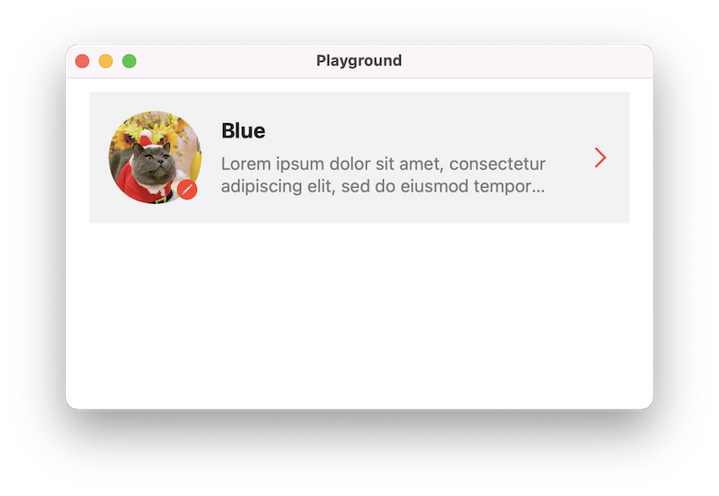

# Fluid

**Fluid** is powered by `ResultBuilder` and a custom layout engine. You can uses a declarative syntax to build your user interface using `UIKit` like `SwiftUI`. Your code is simpler and easier to read.


## Examples



```swift
HStack(spacing: 16) {
    self.imageView
        .aspectRatio(1)
        .frame(width: 80)
        .overlay {
            self.editButton
                .flexible(width: 25%, height: 25%)
                .offset(x: -3, y: -3)
                .frame(maxWidth: .infinity, maxHeight: .infinity, alignment: .bottomTrailing)
        }
    VStack(alignment: .leading) {
        nameLabel
        detailLabel
    }
    Spacer()
    chevronImageView
        .flexible(width: 20, height: 20)
}
.padding()
.background(backgroundView)
```


## Installation

### **Swift Package Manager (SPM)**

### Swift Package Manager

- File > Swift Packages > Add Package Dependency
- Add https://github.com/octree/Fluid.git
- Select "Up to Next Major" with "1.0.0"
